# DTU Ballerup PCB prototyping
Guide for producing PCB's from KiCad with DTU Ballerup equipment. 

<br>

## What will you need?
- [KiCad 9.0+](https://www.kicad.org/download/)
- A **single-sided**[^1] copper PCB FR4 board.
- Have participated in the safety course held by the professor or TA's.

<br>

## Contents
- [What to keep in mind](#what-to-keep-in-mind)
- [Making PCBs with the Fiber laser](#making-pcbs-with-the-fiber-laser)
- [Making PCBs with the Roland CNC router](#making-pcbs-with-the-roland-cnc-router)

<br>

## What to keep in mind
PCB's made in the course [62733](https://kurser.dtu.dk/course/62733) should preferably be made as **one-sided** PCB[^1]. Therefore, make sure to do all of your traces on the back side layer (B.Cu) in the KiCad PCB Editor:

> [!TIP]
> A quick way to check if you have selected the correct layer is, if the traces drawn becomes blue.
>
> If your traces are red, then you have selected the top layer (F.Cu).

It can also be a good idea to increase the size of traces for easier result consistency[^2].
> [!IMPORTANT]
> This step should be done **before** designing your PCB.
>
> It is **not possible to do afterwards.**

**To do so, do as shown in the *GIF*:**
1. Go into *Board Setup*, by clicking the small green circuit icon next to the save button.
2. Choose the *Net Classes* option under *Design Rules*:
3. Change *Clearance* to **0,8 mm** and *Track Width* to a minimum of **0,8 mm**, if possible then 1,0 mm and larger is prefered for working with most through-hole component PCB's made on the Fiber laser and CNC router.


<details>
  <summary><b>Step by step with pictures</summary>
  
   1. Go into *Board Setup*, by clicking the small green circuit icon next to the save button.

   

   2. Choose the *Net Classes* option under *Design Rules*:

   

   3. And change both *Clearance* and *Track Width* to 0,8 mm **minimum**. 1,0 mm and above, if possible, is prefered for working with most through-hole component PCB's made on the Fiber laser and CNC router.
  
</details>


<br>


## Making PCBs with the Fiber laser
- [Selecting the right components](#selecting-the-right-components)
- [Correcting your design for the Laser](#correcting-your-design-for-the-laser)
- [Exporting from KiCad](#exporting-from-kicad)
- [Preparing your PCB](#preparing-your-pcb)
- [Using the Fiber laser](#using-the-fiber-laser)


<br>

### Selecting the right components
Make sure that you have selected the proper footprints for your components. If you use components from the Component-shop on Ballerup Campus, use the footprints at the bottom of this guide [^3].


<br>

### Correcting your design for the Laser
Before moving to making your PCB on the Fiber laser, you'll need to add a *Filled zone* with some certain settings. We do this as a hack to isolate the traces, and save time and material when we use the Fiber laser. If we were to simply export a PCB with only the traces and an outline, the laser would remove everything but the traces, which would take longer, wear out the laser faster, and be more messy than simply removing a smaller area around the traces.

To create a proper *Filled zone* for the purpose of using the Fiber laser, do as shown in the GIF:


<details>
  <summary><b>Step by step with pictures</summary>
  
   1. Select the back cobber layer **B.Cu**.

   2. Select *Draw Filled Zones* from the toolbar on the right.

   3. Select your first corner of the PCB.

   4. Be sure that the *B.Cu* layer is selected, and that *\<no net\>* is selected.

   5. Change the following:
      - *Pad connections* to **None**.
      - *Clearance* to **0,75** mm.
      - *Minimum width* to **0,25** mm.
      - *Fill type* to **Solid fill**.

   6. Finish selecting the rest of your corners, until the board gains a hatched outline.

   7. Go into `Edit` and click `Fill All Zones`.
  
</details>


### Exporting from KiCad:
When choosing to make your PCB with the Fiber laser, you need to do the following steps in KiCad:
#### 1. Open the *Plot* window by going into:
`File - Fabrication Outputs - Gerbers (.gbr)`


#### 2. Change *Plot format* to **DXF**, and select where you wish to save your exported file:

Be sure to choose a folder you can find later, since you will need this file for the actual making of the PCB.


#### 3. In the *Plot* window, make sure that the following settings are selected:

Where the most important settings are as follows:
   - *Include Layers*: **B.Cu**.
   - *Plot on All Layers*: **Edge.Cuts**
   - *Drill marks*: **Small**
   - *Plot graphic items using their contours*: **Unselected**
   - *Plot drawing sheet*: **Unselected**
   - *Export units*: **Millimeters**

When the settings match the list above, export your DXF file by clicking *Plot*.


---

<br>

### Preparing your PCB

The most important step before going out and making or buying a PCB, is doing the your basic checks you learned in the course!
- Have you used the correct footprints?
- Have you designed your PCB on the correct size, and not flipped any components?
- Have you tried running the *Design Rule Checker* (DRC)?
- Have you added your own PCB board cutout in the `Edge.Cuts` layer?
If any of these steps have been skipped or done incorrectly, then making the PCB is a waste because its likely not working once you have it in your hand.

Before going out to find and cut a bare PCB board, take some measuments of your design in KiCad so you know how big to cut your PCB on the shear. Be sure to not going too tight with your measurments. Add around 2mm to your total width and length, so you don't risk your final board coming out too small.


When finding a bare PCB board:
- **Please don't use the boards with the blue film on**. They are not meant for the Fiber laser.
- Do not take a double-sided PCB board.

Ask for a proper bare PCB board if you are not able to find one.

After cutting your board to the correct size (plus your added 2~mm padding), take some 400 grit sandpaper and brush the surface a bit. **Don't overdo it!** We just need to remove the protective/oxide layer before moving onto the Fiber laser.

---

<br>

### Using the Fiber laser
> [!CAUTION]
> **Have you completed the safety course???**
>
> If not, then you are not allowed to use the machine! Please contact the course Professor or TA's, alternativly someone from BuildDesign Lab.

> [!IMPORTANT]
> Please have your **DXF file** and **pre-cut PCB** ready ***before booking the laser***
>
> Otherwise you will end up blocking the machine for others that may be prepared to use the machine.


1. Open the xTool software by clicking on the *xTool Creative Space* icon on the desktop, and create a new project, by clicking on the *X* icon in the top right corner of the window, or by opening a new tab.


2. In the top left corner, click on the **X** icon, then `File` and `Import image`.


3. Find your generated *dxf* file, and open it.


4. When the files is imported, **make sure to *flip* your design and make it *compound***.


5. When you select your design, you should see the right panel change. Select **Engrave**, and make sure that *Output* is green.


6. Confirm that your design looks something like this. **Note**, the black parts of the design will be **removed** by the laser.


> [!NOTE]
> The default import does not make the holes for the through-hole components.
> To fix this, and have the holes engraved as well, click on the icon next to the *Make compound* called **Edit compound**.
> Then select a hole and click delete on your keyboard, it should then become black like the rest of the engraving areas.
> Do this for every hole in your PCB design, untill they are all black.

7. Make sure that the sacrificial build-plate on the Laserbed, and lay your [**prepared board**](#preparing-your-pcb) onto the sacrificial build-plate. Try and get your design to be as much in the center of the machine as possible.

8. Now click on the *Framing* button in the lower right corner of the xTool window. A blue outline of your design will appear on the machinne. Use this box to align your [**prepared board**](#preparing-your-pcb) to where the machine will cut. 


Be sure that the framing box fit and does not spill over the edges.. If the *laser-frame* spills over the edges, then **do not cut!** Your PCB will likely come out wrong, and **you may damage the machine!**.

Also, if your board is cut too close to the final PCB size, it becomes quite difficult to get the alignment right. If its too tight, start over and cut a larger piece. It is much easier to cut your PCB to size **after** it has been engraved, rather than before.


9. If a picture of the machine bed is not shown within the software click on the camera icon next to the automatic height button.
**Make sure** that the design does not flow over the edges! You should strive to place your design as much in the middle of your board as possible.


10. Stop the framing, and then click the *Auto height ajustment* button, and wait for the machine to complete.


11. Click on the presets just beneith the *Engrave* Tab, and select the preset called *PCB*. Make sure that the cutting parameters match those on the pictures, or the updated settings given to you by your instructers, professor or TA's.


**This is your last chance to check if everything seems correct**.


> [!IMPORTANT]
> Please check the following:
> - Is my design mirrored on the Laser software? If not, mirror the design!
> - Is the Traces of my design white, and the area round it black? Remember that the black areas are removed, so if your traces are black, then your PCB is useless.
> - Have I cut the PCB board large enough and have I brushed the surface? If not, then go back and do so.
> - Is my cutting parameters all correct? If not, then go back and make sure the settings match the recommended settings.
> 


12. When everything is ready, click the *Process* button, and follow the steps for starting the machine.

When the machine is working, remember to not stare at the burn light on the PCB!


---

## Making PCBs with the Roland CNC router
The Roland monoFab **SRM-20** is a small desktop CNC mill. Instead of burning the copper away like the Fiber laser, it **mechanically cuts** thin isolation channels around your traces with a spinning endmill, drills the component holes, and cuts the finished board free — all in one setup. It's a good alternative when the laser is busy or unavailable.

The software that turns your KiCad files into machine programs is **SRM-CAM**. It has its own step-by-step guide with photos at **[madsrudolph.github.io/srm-cam](https://madsrudolph.github.io/srm-cam/)**; this section is the short version.

- [Selecting the right components](#selecting-the-right-components-cnc)
- [Correcting your design for the CNC router](#correcting-your-design-for-the-cnc-router)
- [Exporting from KiCad](#exporting-from-kicad-cnc)
- [Generating the toolpaths with SRM-CAM](#generating-the-toolpaths-with-srm-cam)
- [Preparing your PCB](#preparing-your-pcb-cnc)
- [Using the SRM-20](#using-the-srm-20)
- [Double-sided boards (advanced)](#double-sided-boards-advanced)
- [Bed leveling (optional)](#bed-leveling-optional)
- [Tell us how it went](#tell-us-how-it-went)

<br>

### Selecting the right components (CNC)
Exactly the same as for the Fiber laser — single-sided, with all traces on the back layer (**B.Cu**) and the through-hole footprints listed at the bottom of this guide[^3].

<br>

### Correcting your design for the CNC router
Unlike the Fiber laser, the CNC router does **not** need a *Filled zone* — the mill isolates each trace by cutting a thin channel around it, so there is no large area to clear away. Instead it has its own rule:

> [!IMPORTANT]
> **Your clearance must be at least as wide as the endmill.** A 0,8 mm endmill physically cannot fit inside a 0,8 mm gap, so it cannot separate two traces that are only 0,8 mm apart.

So set your *Clearance* (see [What to keep in mind](#what-to-keep-in-mind)) according to the endmill you will use:
- **0,8 mm flat endmill** (the usual bit): use at least **1,0 mm** clearance — **1,2 mm** is safer.
- **0,4 mm (1/64") engraving bit**: can isolate the standard **0,8 mm** clearance.

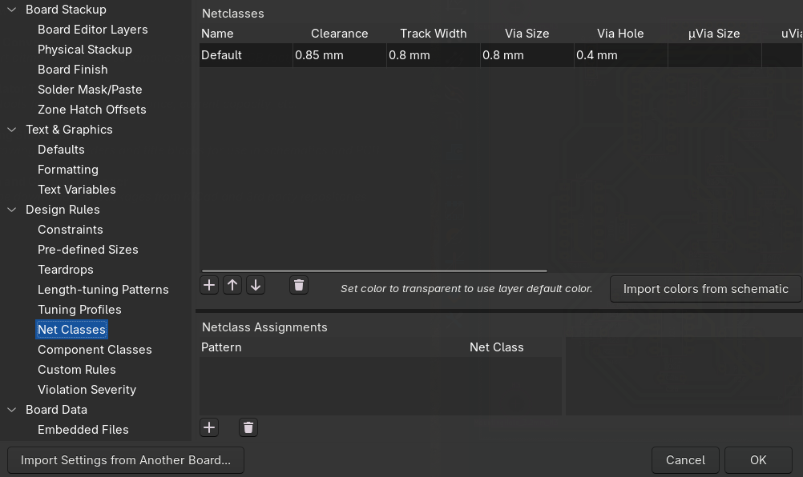

Everything else is the same as for the laser: keep all traces on **B.Cu**, use through-hole footprints, run the **Design Rule Checker (DRC)**, and draw your board outline on the **Edge.Cuts** layer.

> [!TIP]
> **Does the board fit the machine?** SRM-CAM can add a button to KiCad's PCB editor that draws the SRM-20's build area around your board and tells you whether it fits — while you can still change it. In SRM-CAM: `KiCad → Set up the build-area plugin…`, then restart KiCad and find it under `Tools → External Plugins → Show SRM-20 build area` (it is also on the toolbar).
>
> 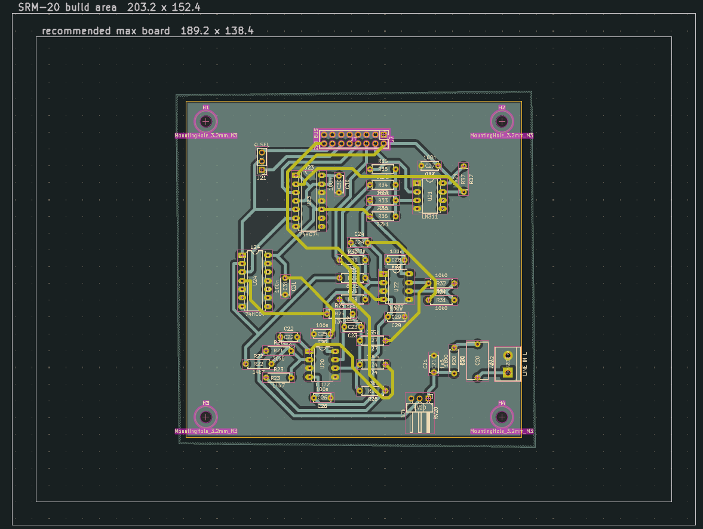

> [!TIP]
> You don't have to eyeball whether the bit fits. SRM-CAM's **checks** page lists every gap too narrow for the bit you picked, and marks the spots that would end up shorted. Zero findings = your clearances are fine.

> [!TIP]
> A small **fillet** (rounded corner) on each corner of your `Edge.Cuts` outline gives a cleaner cut-out and a board that's nicer to handle. Sharp corners work too.

<br>

### Exporting from KiCad (CNC)
The CNC router does **not** use a DXF like the laser. It needs **Gerber + drill files**, which SRM-CAM turns into machine code.

#### 1. Open the *Plot* window:
`File → Fabrication Outputs → Gerbers (.gbr)`

#### 2. Choose an output folder you can find again, and tick at least these layers:
   - **B.Cu** — your copper
   - **Edge.Cuts** — the board outline
   - (**F.Cu** as well, only for a double-sided board)

Leave the format on **Gerber** and click **Plot**.

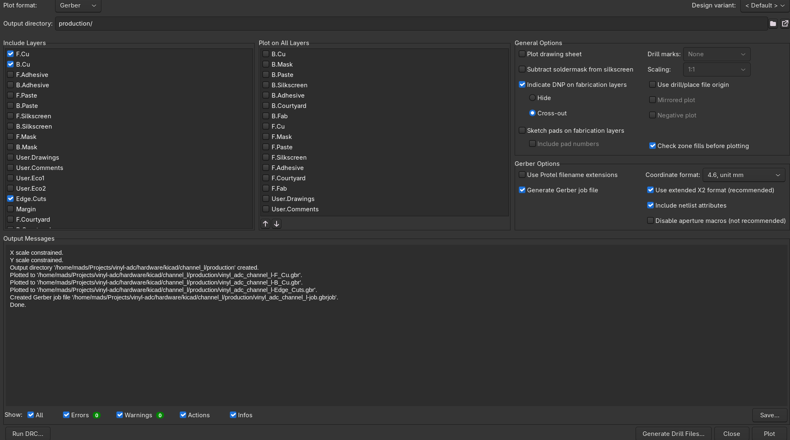

#### 3. Generate the drill file:
In the same window click **Generate Drill Files…**, leave the defaults (**Excellon**, **Millimeters**), and click **Generate**.

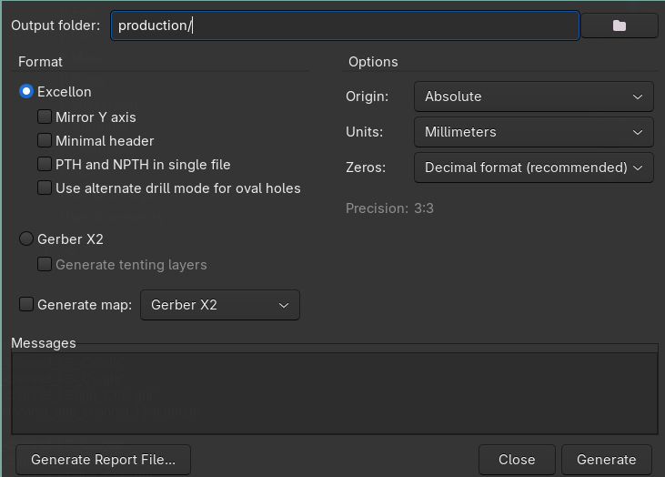

You should end up with a folder containing a `*-B_Cu.gbr`, an `*-Edge_Cuts.gbr` and a `*.drl` drill file.

---

<br>

### Generating the toolpaths with SRM-CAM
[SRM-CAM](https://github.com/MadsRudolph/srm-cam) reads your Gerber folder and writes the **programs** the SRM-20 runs, plus a run sheet that says in which order to send them.

#### Install (one-time)
Download **[`SRM-CAM-Setup.exe`](https://github.com/MadsRudolph/srm-cam/releases/latest/download/SRM-CAM-Setup.exe)** (always the newest build) and run it. It installs like any normal Windows program — you get Start-menu and desktop shortcuts, and **no Git or Python is needed**. On Linux there is an AppImage on the [releases page](https://github.com/MadsRudolph/srm-cam/releases/latest). To install a newer version later, run the new installer over the old one; your setups survive. The app checks for a newer release when it opens and tells you once, with the download link (`Help → Check for updates…` asks any time).

<details>
<summary><b>Alternative: run from source (advanced)</b></summary>

Install **[Git](https://git-scm.com/downloads)** and **[Python 3.10 or newer](https://www.python.org/downloads/)** first (tick **"Add python.exe to PATH"** when installing Python). Then open **PowerShell** and run these, one block at a time:

```powershell
git clone https://github.com/MadsRudolph/srm-cam.git
cd srm-cam
python -m venv .venv
.venv\Scripts\python -m pip install -e ".[gui]"
.venv\Scripts\python -m gerber2rml          # launch (every time; cd into srm-cam first)
```

On macOS or Linux, use `.venv/bin/python` instead of `.venv\Scripts\python`.

</details>

#### The window
Open **SRM-CAM** from the Start menu. The window has four parts that never move:

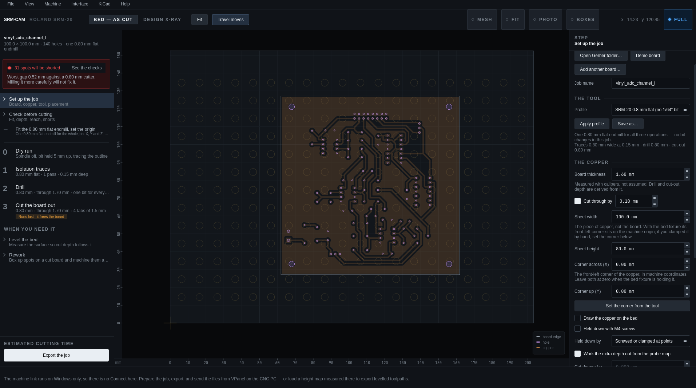

- **The rail** (left) is the **run plan**: the steps in the order you will send them. Numbered steps are files; the rows between them are things you do by hand (fit the bit, set the origin).
- **The stage** (middle) is the machine's bed at true size, with the copper sheet, your board and the toolpaths of the selected step.
- **The inspector** (right) shows the selected step: the setup page, the checks, or a step's settings and file.
- **The machine bar** (bottom) is always there, and so is **STOP**.

Every step explains itself on the right as you go, so you rarely need this guide open beside it. `Help → The machine, in five minutes` is the short lesson on the machine itself; **F1** opens the full web guide.

> [!NOTE]
> SRM-CAM opens in **Essential** mode: the whole single-sided job, including bed levelling, and nothing else. `Interface → Full` adds double-sided boards, rework and the per-step cutting parameters. Stay in Essential for a normal board.

#### Using it

1. `File → Open Gerber folder…` and pick your exported **Gerber folder**. The board lands on the bed and the run plan fills in.

2. **SRM-CAM is already set up for the SRM-20** — G-code output and the *SRM-20 0,8 mm* tool profile are the defaults, so you normally change nothing. Check that the **board thickness** on the setup page matches your copper (measure it with calipers); the drill and cut-out depths are worked out from it.

> [!NOTE]
> Every hole is drilled with the same 0,8 mm endmill: holes wider than the bit are **milled as circles**, so you never stop to swap bits.

3. Click **Check before cutting** on the rail. The findings say whether the board fits the bed, whether the bit fits the holes, which nets are closer than the bit, and whether the job runs off the copper. Fix the red ones first.

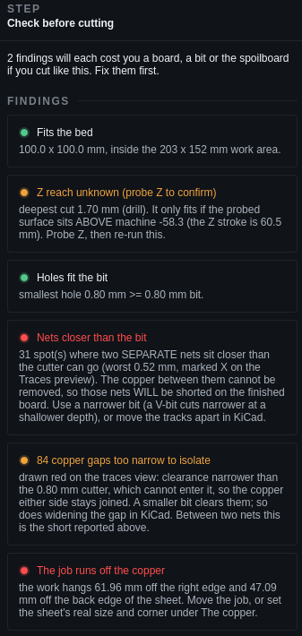

4. Click each numbered step to see its toolpath on the bed. The **dry run** (step 0) traces the outline with the spindle off and the bit held up: twenty seconds that show whether the copper is in the right place.

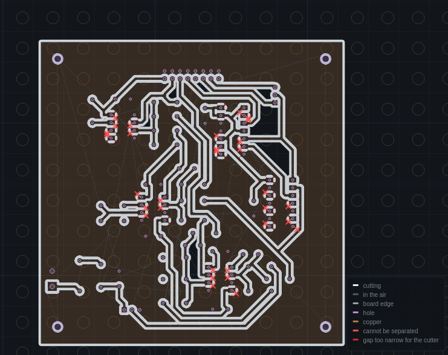

5. Click **Export the job**. You get one program per step and the **run sheet**, which replaces the board on screen: every step with its file, its bit, its depth and its time, in the order to send them. `Copy the plan` puts it on the clipboard for the logbook; `Open the folder` shows the files.

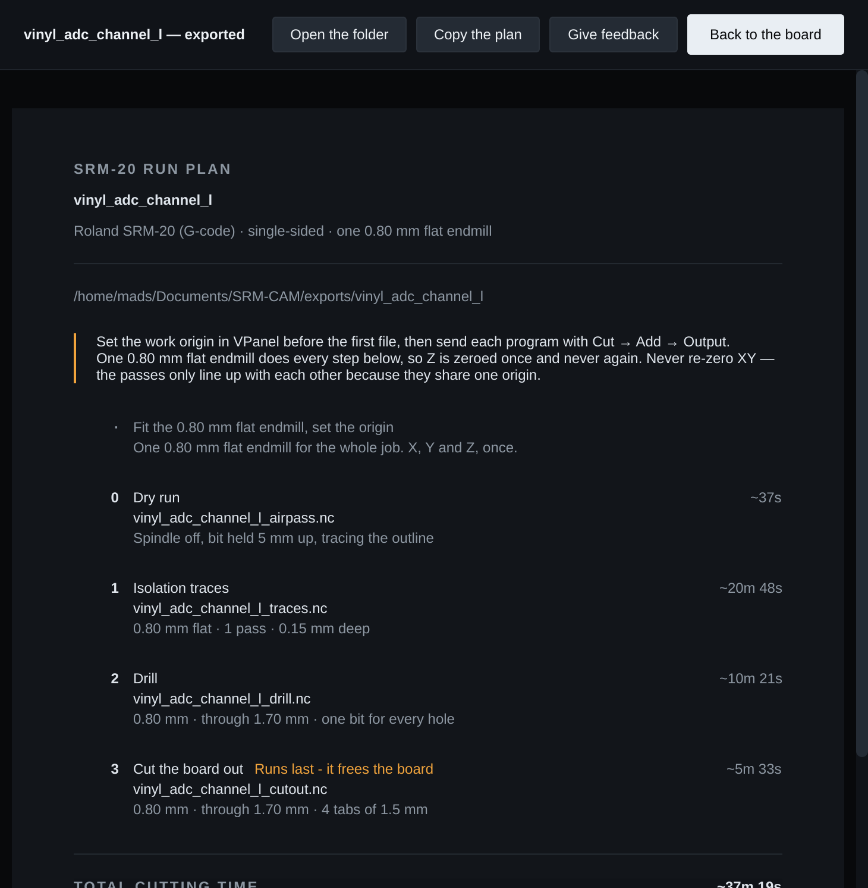

> [!IMPORTANT]
> SRM-CAM writes **G-code (`.nc`)**, so VPanel's command set must be **NC code**. RML (`.rml`) files need **RML-1**. The two are not interchangeable.

> [!IMPORTANT]
> The **cut-out depth must be larger than your board thickness** so the board actually comes free. It is derived from the thickness you typed, so type the real one.

> [!TIP]
> `View → Watch this step in 3D…` plays the bit along the selected step's toolpath, and `View → Simulate a file in 3D…` does the same for any exported file — a quick way to spot a wrong depth or a move that runs off the board.

---

<br>

### Preparing your PCB (CNC)
The same as for the laser (see [Preparing your PCB](#preparing-your-pcb)), with two milling-specific points:

- The cut-out step mills **all the way through**, so there must be a flat **sacrificial surface** under the board — otherwise the bit cuts into the machine bed.
- **The board is held by the bed's clamps — you don't need tape.** The SRM-20's bed has fixed **conical clamping brackets** that press against the board edges from each side so it can't slip; seat your board snugly between them. (A strip of double-sided tape underneath is an optional extra if you want it held even more firmly.) The board must sit **flat** — any gap or warp changes the cut depth and ruins the isolation.

<br>

### Using the SRM-20
> [!CAUTION]
> **Have you completed the safety course???**
>
> If not, then you are not allowed to use the machine! Please contact the course Professor or TA's, alternativly someone from BuildDesign Lab.

> [!CAUTION]
> **Handle the endmills with care.** They are thin, brittle and **expensive to replace** — a snapped bit is both easy to do and costly. Don't force the bit or drop it, keep the feeds and cut depths sensible, and make sure it's properly seated in the collet before you cut.

The SRM-20 is driven from the **VPanel** software. The whole board is cut from **one origin**, so the traces, holes and cut-out all line up.

#### The three coordinate systems
VPanel's coordinate display (the dropdown in the top-left) can show three different systems. Knowing which is which avoids the classic *"my holes don't line up"* and *"the bit lifts to the top"* mistakes:

| System | Who uses it | What it is |
|---|---|---|
| **Machine coordinate system** | You — for **checking** only | The machine's own **fixed** reference; its origin never moves. **Z = 0 is the very top** of the Z travel, with the bed ~60,5 mm below. Switch to this to *read* your Z headroom (the −50 mm check below) — you never cut in it. |
| **User coordinate system** | **RML (`.rml`)** jobs | The work origin **you** set by jogging to your board and clicking *Set Origin Point*. |
| **G54** | **NC code (`.nc`)** jobs — what SRM-CAM writes | The **same kind** of work origin, under the name G-code uses for it. A `.nc` file says `G54` to mean "measure from the origin I set." |

<!-- pending screenshot from the CNC PC: vpanel_coord_dropdown.png — VPanel coordinate-system dropdown -->
1. Power on the machine and open **VPanel**.
2. **Set the command set** to **NC code** (`Setup → Command set`). SRM-CAM's files are `.nc`.
   <!-- pending screenshot from the CNC PC: vpanel_command_set.png — VPanel command set -->
3. Seat your board in the bed's **clamping brackets** (on top of the sacrificial surface) so it's held flat, and fit the endmill.
4. **Leave X and Y alone.** They are already at the machine's origin, which is what SRM-CAM's files assume: the front-left corner of the copper sits on it when the brackets hold the board. You only set **Z**.
5. **Set the Z origin with the bit-drop method:**
   - Bring the Z axis down until the bit **almost** touches the copper.
   - **Loosen the collet** so the bit can slide freely, and let it **drop down onto the copper** so the tip rests on the surface.
   - With the bit still loose, bring the Z axis **down a little further** to press the bit further up into the collet — this keeps the tip pressed firmly onto the copper.
   - **Tighten the collet**, being careful **not to push the bit upwards as you tighten** — nudging it up lifts the tip off the surface and ruins the Z-zero.
   - Set the **Z origin** here (the **Z** button under *Set Origin Point*, with G54 selected): the bit tip is now sitting exactly on the copper surface.
   - **Check you have enough downward travel left:** switch VPanel's coordinate display to **Machine Coordinate System** and read the Z value at the surface — it should be about **−50 mm or higher** (i.e. *less* negative). If it sits lower than that, raise the board on more sacrificial material and re-zero before cutting.
   <!-- pending screenshot from the CNC PC: vpanel_z_origin.png — VPanel set Z origin (bit-drop method) -->
   <!-- pending screenshot from the CNC PC: vpanel_machine_z.png — VPanel machine-Z headroom check -->
6. **Run the programs in the order the run sheet says: dry run → traces → drill → cut-out.** In VPanel: `Cut → Add → pick the file → Output`. They share the same endmill and X/Y origin, so **do not move or re-home the board between them**. If you swap the bit, **re-set only the Z origin** — never touch X/Y.

> [!IMPORTANT]
> Always run the **cut-out last**. It frees the board (held only by the small tabs), so anything done after it would shift out of alignment.

> [!WARNING]
> **Bit lifting to full height after every plunge, and holes or the cut-out not going all the way through?** Both are the *same* problem — and it is **not** an NC-vs-RML quirk; it happens in both command sets.
>
> The SRM-20 has only **60,5 mm of Z travel**, with its Z-zero (machine origin) at the **top**. The copper surface you zero on sits somewhere down that range. If it sits **too low**, the deep cuts (drill and cut-out, ~2 mm) reach past the machine's lower limit and fall **outside the cuttable range**. When that happens the SRM-20 **raises the bit to the top** until the toolpath comes back into range — so you see a dramatic full-height lift after every plunge *and* cuts that stop short of going through the board.
>
> **Fix — give the bit more room below the surface:** use a **thicker sacrificial board** under the PCB and/or **extend the endmill further out of the collet**, then re-set the Z origin. Verify it with VPanel's display in **Machine Coordinate System**: the surface should read about **−50 mm or higher**. SRM-CAM's checks page repeats this rule as *Z reach* once the surface has been probed.

> [!TIP]
> With a laptop plugged into the machine's Arduino, SRM-CAM's machine bar can **Pause** and **Resume** a running job, and **STOP** it. STOP is not a pause: the bit stays where it is and the job does not resume. Raise the bit (Page Up) before you jog anywhere.

When the board is finished, snap the tabs, file the edges smooth, and your PCB is ready.

A correctly milled board looks like this — clean isolation channels around every trace, rounded corners, and the board still held in the surrounding stock by its small break-off tabs (held up to the light here so you can see the routed gaps):

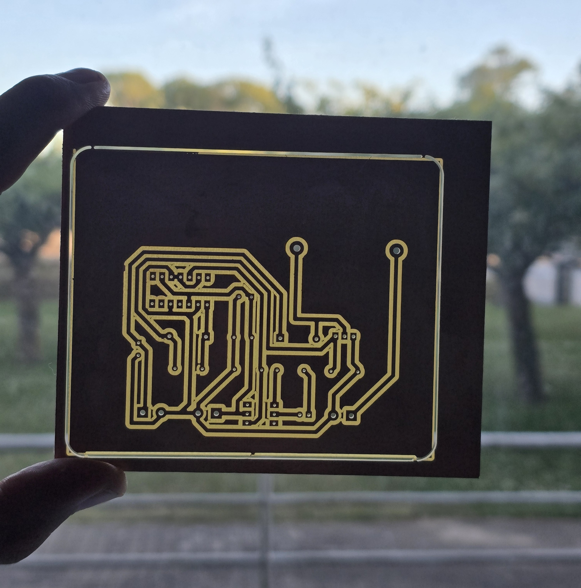

> [!TIP]
> Want **silkscreen labels** (the component names) on top? Export the **F.Silkscreen** layer as a DXF (do **not** mirror it) and engrave it on the bare top side with the Fiber laser.

<br>

### Double-sided boards (advanced)
> [!NOTE]
> The course defaults to single-sided boards[^1]. Two-sided boards are possible on the SRM-20 but more fiddly — only attempt them after checking with the people responsible for the machine.

For a two-sided board you mill the bottom, **flip the board**, and mill the top from the *same* origin. SRM-CAM keeps the two sides aligned off **holes the machine itself drilled**, never the (never-quite-square) sheared board edge.

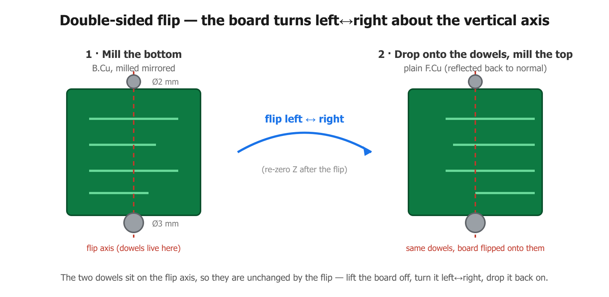

In SRM-CAM (`Interface → Full`): export your board with an **F.Cu** layer present, tick **This board has copper on both faces** on the setup page, and pick a **registration**:

- **Dowel pins** (recommended) — the mill drills two holes through the stock and on into the sacrificial bed; you seat pins and flip onto them. No measuring. The setup page lets you choose which edge pair the pins sit beyond (that is also the flip direction), the pin sizes and how deep they bite into the bed, and can **re-cut just the dowel holes** deeper if a pin does not seat.
- **Fiducial holes** — the mill drills reference holes in the stock; you flip, re-place freely, and probe where they actually landed so the top is fitted to the real position. Tell it which way you turned the board (**Flipped**: left-right or top-bottom): the fit cannot detect a wrong choice, and a wrong one mirrors every top-side trace.

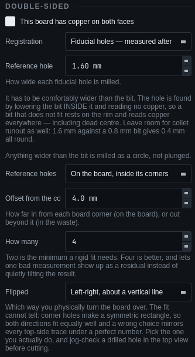

The run plan changes: the **align** program (the holes) comes first, then the bottom, then the flip, then the top, and the **cut-out last**, because it frees the board from its own registration. Follow the run sheet step by step, and re-zero **only Z** after the flip.

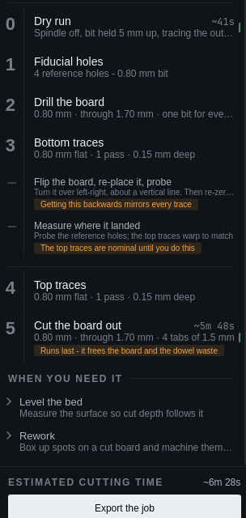

`Design X-ray` (Ctrl+D) shows both faces overlaid in the design frame, the way they are meant to line up:

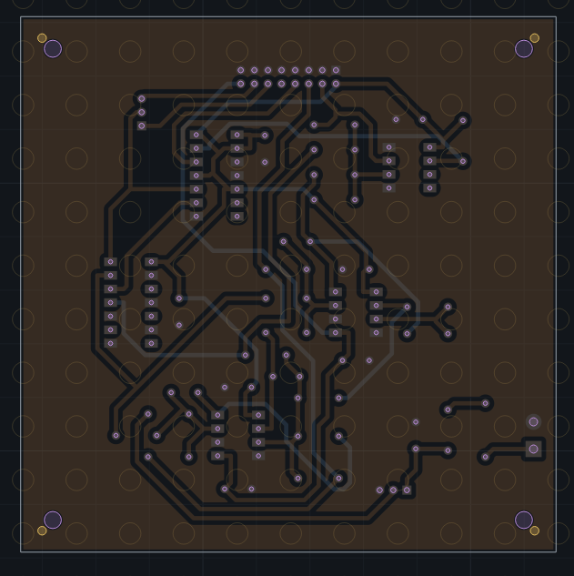

Done right, both sides line up through the holes. Here's a finished double-sided board milled this way, held up to the light:

<table>
<tr>
<td width="50%"><br><sub><b>Bottom side — B.Cu</b></sub></td>
<td width="50%"><br><sub><b>Top side — F.Cu</b></sub></td>
</tr>
</table>

<br>

### Bed leveling (optional)
The lab's SRM-20 has the **touch probe** installed, so there's nothing to set up — you just attach the clips. Bed leveling probes the copper surface and builds a height map, so the isolation depth stays consistent even if the board is slightly bowed or the bed isn't perfectly flat. It is part of Essential mode, so it is always there.

1. Plug your laptop into the machine's **Arduino** with the USB cable and click **Connect** on SRM-CAM's machine bar. (Close the Arduino Serial Monitor first — only one program can hold the port.)
2. Attach the alligator clips: **red → the copper board**, **black → the drill bit**. Put paper or tape under the board so it is isolated from the bed.
3. Set the Z origin on the copper as above, and leave the bit a couple of millimetres above it.
4. On the rail, open **Level the bed**: build the grid, then **Probe**. The bit taps each grid point and the measured surface draws itself over the board. If you STOP part-way, the next Probe offers to do only the missing points. **Check the mesh…** flags any point the probe got wrong and suggests where the grid is too coarse.
5. Tick **Apply on export**, save the setup (`Ctrl+S`: the map is minutes of machine time), and export. Every cut now follows the surface.

> [!CAUTION]
> **Take the black clip off the drill bit before you cut anything.** If it's left on the tool during milling it will snag and snap the bit (and can damage the probe). Clips on for probing only — **off for every cut**.

> [!NOTE]
> The machine link runs on Windows. On Linux, prepare and export the job, probe on the CNC PC, and carry the height map over as a CSV (`Level the bed → Save`).

<br>

### Tell us how it went
Two minutes of [feedback](https://madsrudolph.github.io/srm-cam/feedback.html?for=guide) on what was unclear, while it is fresh, is what changes this guide and the app for the next student. No account, nothing to install; the run sheet has the same button.

<br>

---

[^1]: Currently we are limited to one-sided PCB's until further testing and workflows are prepared. The students are free to try their hand ad two-sided PCB's, but should then consult with the people responsible for the machines, and it will be at their own risk and time.

[^2]: This step is only necessary for PCB-milling and Fiber-etching.

[^3]: List of footprints for the components in the DTU-components-shop:

| Component                      | DTU Component shop name | KiCAD footprint                                                      |
|--------------------------------|-------------------------|----------------------------------------------------------------------|
| Resistors                      | Resistor section        | Resistor_THT:R_Axial_DIN0204_L3.6mm_D1.6mm_P7.62mm_Horizontal        |
| Potentiometer                  |                         | Potentiometer_THT:Potentiometer_ACP_CA9-V10_Vertical                 |
| PinSockets                     | Connector section       | Connector_PinSocket_2.54mm:PinSocket_1x02_P2.54mm_Vertical           |
| PinHeaders                     | Connector section       | Connector_PinHeader_2.54mm:PinHeader_1x02_P2.54mm_Vertical           |
| Molex pin connector            | Connector section       | Connector_Molex:Molex_SL_171971-0002_1x02_P2.54mm_Vertical           |
| ICs and sockets (8)            | Connector section       | Package_DIP:DIP-8_W7.62mm_LongPads                                   |
| ICs and sockets (14)           | Connector section       | Package_DIP:DIP-14_W7.62mm_LongPads                                  |
| ICs and sockets (16)           | Connector section       | Package_DIP:DIP-16_W7.62mm_LongPads                                  |
| Diodes                         |                         | Diode_THT:D_DO-35_SOD27_P7.62mm_Horizontal                           |
| Large LEDs                     | LED section             | LED_THT:LED_D5.0mm                                                   |
| Small LEDs                     | LED section             | LED_THT:LED_D3.0mm                                                   |
| Effect-resistor                |                         | Resistor_THT:R_Axial_DIN0617_L17.0mm_D6.0mm_P20.32mm_Horizontal      |
| Screw terminal (3 connecters)  |                         | TerminalBlock:TerminalBlock_bornier-3_P5.08mm                        |