## Making PCBs with the Roland CNC router
The Roland monoFab **SRM-20** is a small desktop CNC mill. Instead of burning the copper away like the Fiber laser, it **mechanically cuts** thin isolation channels around your traces with a spinning endmill, drills the component holes, and cuts the finished board free — all in one setup. It's a good alternative when the laser is busy or unavailable.

The software that turns your KiCad files into machine programs is **SRM-CAM**. It has its own step-by-step guide with interactive explainers at **[madsrudolph.github.io/srm-cam](https://madsrudolph.github.io/srm-cam/)**; this section is the short version.

#### Watch it first: the 13-minute video guide
[](https://youtu.be/aab9ItDjwt0)

**[Milling a PCB on the Roland SRM-20 with SRM-CAM](https://youtu.be/aab9ItDjwt0)**: the whole job, KiCad to a finished board, with chapters. This page follows the same order.

- [Selecting the right components](#selecting-the-right-components-cnc)
- [Correcting your design for the CNC router](#correcting-your-design-for-the-cnc-router)
- [Exporting from KiCad](#exporting-from-kicad-cnc)
- [Generating the toolpaths with SRM-CAM](#generating-the-toolpaths-with-srm-cam)
- [Preparing your PCB](#preparing-your-pcb-cnc)
- [Using the SRM-20](#using-the-srm-20)
- [Finishing and checking the board](#finishing-and-checking-the-board)
- [Leave the machine as you found it](#leave-the-machine-as-you-found-it)
- [Double-sided boards (advanced)](#double-sided-boards-advanced)
- [Drilling a board etched on the laser](#drilling-a-board-etched-on-the-laser)
- [Bed leveling](#bed-leveling)
- [Tell us how it went](#tell-us-how-it-went)

<br>

### Selecting the right components (CNC)
Exactly the same as for the Fiber laser — single-sided, with all traces on the back layer (**B.Cu**) and the through-hole footprints listed in the [footprints table](footprints_table.md).

<br>

### Correcting your design for the CNC router
Unlike the Fiber laser, the CNC router does **not** need a *Filled zone* — the mill isolates each trace by cutting a thin channel around it, so there is no large area to clear away. Instead it has its own rule:

> [!IMPORTANT]
> **Your clearance must be at least as wide as the endmill.** A 0,8 mm endmill physically cannot fit inside a 0,8 mm gap, so it cannot separate two traces that are only 0,8 mm apart.

So set your *Clearance* (see [What to keep in mind](#what-to-keep-in-mind)) according to the endmill you will use:
- **0,8 mm flat endmill** (the usual bit): use at least **1,0 mm** clearance — **1,2 mm** is safer.
- **0,4 mm (1/64") engraving bit**: can isolate the standard **0,8 mm** clearance.

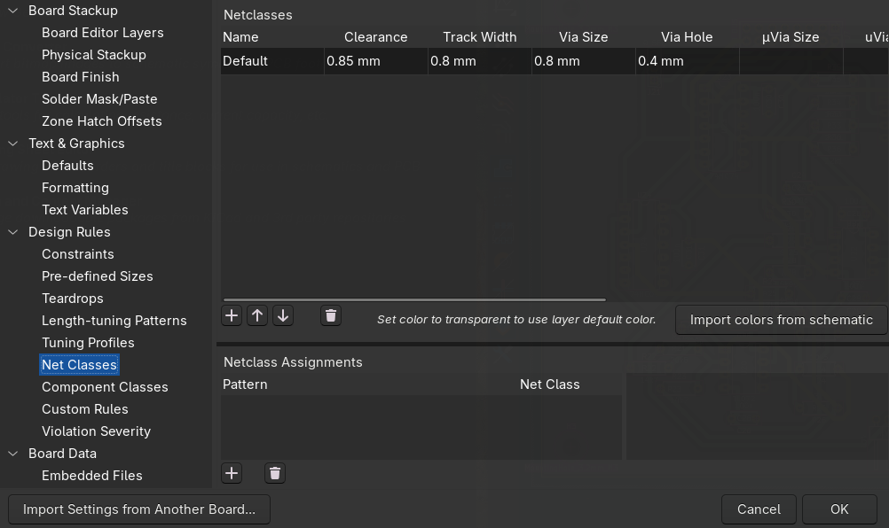

Everything else is the same as for the laser: keep all traces on **B.Cu**, use through-hole footprints, run the **Design Rule Checker (DRC)**, and draw your board outline on the **Edge.Cuts** layer.

> [!TIP]
> **Does the board fit the machine?** SRM-CAM can add a button to KiCad's PCB editor that draws the SRM-20's build area around your board and tells you whether it fits — while you can still change it. In SRM-CAM: `KiCad → Set up the build-area plugin…`, then restart KiCad and find it under `Tools → External Plugins → Show SRM-20 build area` (it is also on the toolbar).
>
> 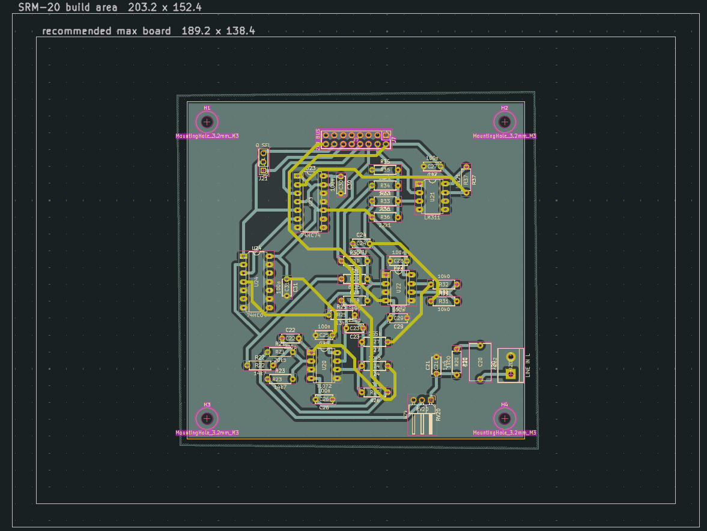

> [!TIP]
> You don't have to eyeball whether the bit fits. SRM-CAM's **checks** page lists every gap too narrow for the bit you picked, and marks the spots that would end up shorted. Zero findings = your clearances are fine.

> [!TIP]
> A small **fillet** (rounded corner) on each corner of your `Edge.Cuts` outline gives a cleaner cut-out and a board that's nicer to handle. Sharp corners work too.

<br>

### Exporting from KiCad (CNC)
The CNC router does **not** use a DXF like the laser. It needs **Gerber + drill files**, which SRM-CAM turns into machine code.

#### 1. Open the *Plot* window:
`File → Fabrication Outputs → Gerbers (.gbr)`

#### 2. Choose an output folder you can find again, and tick at least these layers:
   - **B.Cu** — your copper
   - **Edge.Cuts** — the board outline
   - (**F.Cu** as well, only for a double-sided board)

Leave the format on **Gerber** and click **Plot**.

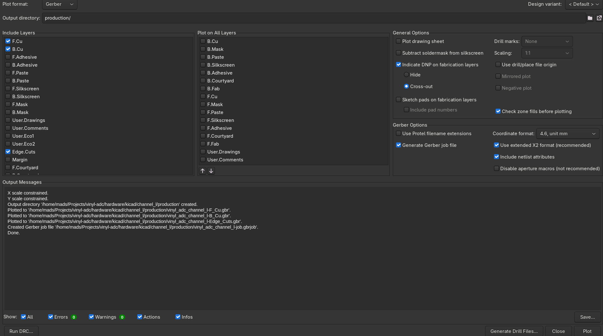

#### 3. Generate the drill file:
In the same window click **Generate Drill Files…**, leave the defaults (**Excellon**, **Millimeters**), and click **Generate**.

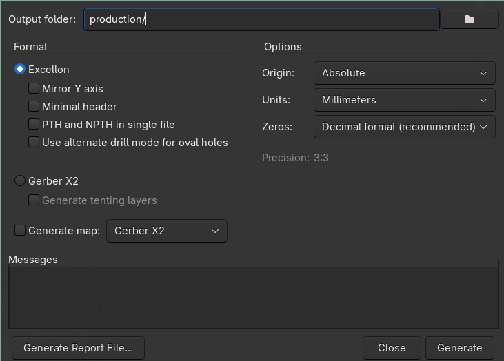

You should end up with a folder containing a `*-B_Cu.gbr`, an `*-Edge_Cuts.gbr` and a `*.drl` drill file.

---

<br>

### Generating the toolpaths with SRM-CAM
[SRM-CAM](https://github.com/MadsRudolph/srm-cam) reads your Gerber folder and writes the **programs** the SRM-20 runs, plus a run sheet that says in which order to send them.

#### Install (one-time)
Download **[`SRM-CAM-Setup.exe`](https://github.com/MadsRudolph/srm-cam/releases/latest/download/SRM-CAM-Setup.exe)** (always the newest build) and run it. It installs like any normal Windows program — you get Start-menu and desktop shortcuts, and **no Git or Python is needed**. On Linux there is an AppImage on the [releases page](https://github.com/MadsRudolph/srm-cam/releases/latest).

> [!TIP]
> **No free PC at the mill?** Install SRM-CAM and VPanel on your own **Windows** laptop and plug in both USB cables: the **white** one is the mill (for VPanel), the **black** one is the Arduino probe link (for SRM-CAM). The machine link and VPanel are Windows-only. To install a newer version later, run the new installer over the old one; your setups survive. The app checks for a newer release when it opens and tells you once, with the download link (`Help → Check for updates…` asks any time).

<details>
<summary><b>Alternative: run from source (advanced)</b></summary>

Install **[Git](https://git-scm.com/downloads)** and **[Python 3.10 or newer](https://www.python.org/downloads/)** first (tick **"Add python.exe to PATH"** when installing Python). Then open **PowerShell** and run these, one block at a time:

```powershell
git clone https://github.com/MadsRudolph/srm-cam.git
cd srm-cam
python -m venv .venv
.venv\Scripts\python -m pip install -e ".[gui]"
.venv\Scripts\python -m gerber2rml          # launch (every time; cd into srm-cam first)
```

On macOS or Linux, use `.venv/bin/python` instead of `.venv\Scripts\python`.

</details>

#### The window
Open **SRM-CAM** from the Start menu. The window has four parts that never move:

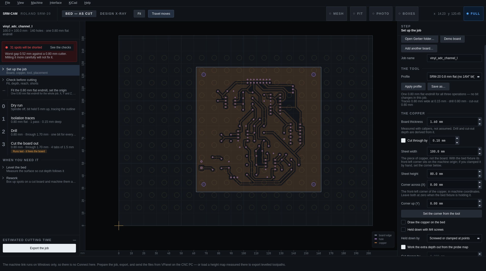

- **The rail** (left) is the **run plan**: the steps in the order you will send them. Numbered steps are files; the rows between them are things you do by hand (fit the bit, set the origin).
- **The stage** (middle) is the machine's bed at true size, with the copper sheet, your board and the toolpaths of the selected step.
- **The inspector** (right) shows the selected step: the setup page, the checks, or a step's settings and file.
- **The machine bar** (bottom) is always there, and so is **STOP**.

Every step explains itself on the right as you go, so you rarely need this guide open beside it. `Help → The machine, in five minutes` is the short lesson on the machine itself; **F1** opens the full web guide.

> [!NOTE]
> SRM-CAM opens in **Essential** mode: the whole single-sided job, including bed levelling and rework. `Interface → Full` adds double-sided boards and the per-step cutting parameters (including *Cut gaps too narrow for the bit*). Stay in Essential for a normal board.

#### Using it

1. `File → Open Gerber folder…` and pick your exported **Gerber folder**. The board lands on the bed and the run plan fills in.

2. **SRM-CAM is already set up for the SRM-20** — G-code output and the *SRM-20 0,8 mm* tool profile are the defaults, so you normally change nothing. Check that the **board thickness** on the setup page matches your copper (measure it with calipers); the drill and cut-out depths are worked out from it.

> [!NOTE]
> Every hole is drilled with the same 0,8 mm endmill: holes wider than the bit are **milled as circles**, so you never stop to swap bits. With one bit for everything, SRM-CAM puts the **drill before the traces**, which is the lab's preferred order.

3. Two boards fit on the sheet? `File → Add another board to the sheet…` and pick the same folder, then `Set up the job → Where it sits on the bed → Butt them together`: touching boards share one cut, and each loses just 0,4 mm along that edge.

4. Click **Check before cutting** on the rail. The findings say whether the board fits the bed, whether the bit fits the holes, which nets are closer than the bit, and whether the job runs off the copper. Fix the red ones first. Nets closer than the bit are best fixed with more clearance in KiCad; if you can't, `Interface → Full`, then `Isolation traces → Cutting parameters → Cut gaps too narrow for the bit` cuts down the middle anyway, trimming a little off the pads.

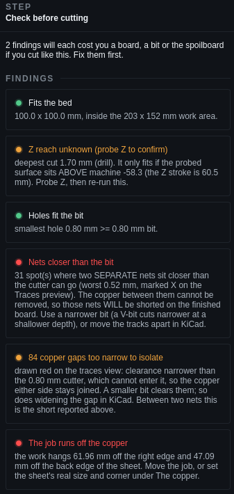

5. Click each numbered step to see its toolpath on the bed. The **dry run** (step 0) traces the outline with the spindle off and the bit held up: twenty seconds that show whether the copper is in the right place.

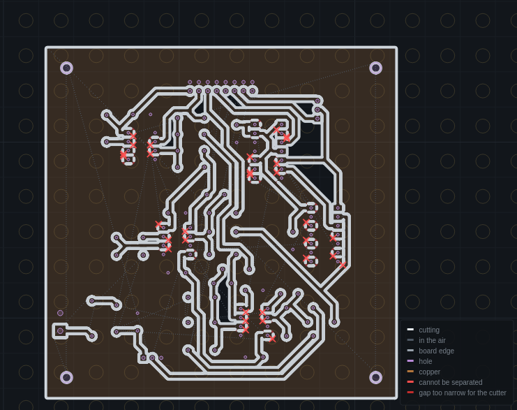

6. Click **Export the job**. You get one program per step and the **run sheet**, which replaces the board on screen: every step with its file, its bit, its depth and its time, in the order to send them. `Copy the plan` puts it on the clipboard for the logbook; `Open the folder` shows the files.

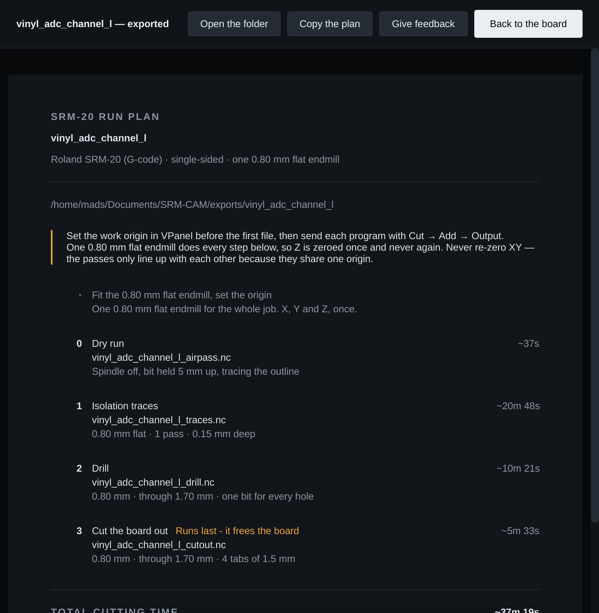

> [!IMPORTANT]
> SRM-CAM writes **G-code (`.nc`)**, so VPanel's command set must be **NC code**. RML (`.rml`) files need **RML-1**. The two are not interchangeable.

> [!IMPORTANT]
> The **cut-out depth must be larger than your board thickness** so the board actually comes free. It is derived from the thickness you typed, so type the real one.

> [!TIP]
> `View → Watch this step in 3D…` plays the bit along the selected step's toolpath, and `View → Simulate a file in 3D…` does the same for any exported file — a quick way to spot a wrong depth or a move that runs off the board.

---

<br>

### Preparing your PCB (CNC)
The same as for the laser (see [Preparing your PCB](README.md#preparing-your-pcb)), with two milling-specific points:

- The cut-out step mills **all the way through**, so there must be a flat **sacrificial surface** under the board — otherwise the bit cuts into the machine bed.
- **Best: double-sided tape across the back.** It is the easiest to set up, and the board lies flat, so the surface the probe measures is the surface that gets cut. In SRM-CAM this is `Set up the job → The copper → Held down by → Bonded across the whole back (tape)`, the default.
- **Second best: the four disc clamps.** Each is a plastic disc with a chamfered side on an off-centre screw. Screw it through a spoilboard hole into the threads of the plate underneath, **beside** the board, then turn the disc until its chamfer presses on the board's edge. Use all **four**, one on each side: the clamping force has to come from all sides, or the board slides away from the open side. In SRM-CAM choose `Held down by → Screwed or clamped at points`, which deepens the cut a little where a board held at its edges arches.
- Nothing goes under the copper (no paper, no tape as insulation): the spoilboard is wood.

<br>

### Using the SRM-20
> [!CAUTION]
> **Have you completed the safety course???**
>
> If not, then you are not allowed to use the machine! Please contact the course Professor or TA's, alternativly someone from BuildDesign Lab.

> [!CAUTION]
> **Handle the endmills with care.** They are thin, brittle and **expensive to replace** — a snapped bit is both easy to do and costly. Don't force the bit or drop it, keep the feeds and cut depths sensible, and make sure it's properly seated in the collet before you cut.

The SRM-20 is driven from the **VPanel** software. The whole board is cut from **one origin**, so the traces, holes and cut-out all line up.

#### The three coordinate systems
VPanel's coordinate display (the dropdown in the top-left) can show three different systems. Knowing which is which avoids the classic *"my holes don't line up"* and *"the bit lifts to the top"* mistakes:

| System | Who uses it | What it is |
|---|---|---|
| **Machine coordinate system** | You — for **checking** only | The machine's own **fixed** reference; its origin never moves. **Z = 0 is the very top** of the Z travel, with the bed ~60,5 mm below. Switch to this to *read* your Z headroom (the −50 mm check below) — you never cut in it. |
| **User coordinate system** | **RML (`.rml`)** jobs | The work origin **you** set by jogging to your board and clicking *Set Origin Point*. |
| **G54** | **NC code (`.nc`)** jobs — what SRM-CAM writes | The **same kind** of work origin, under the name G-code uses for it. A `.nc` file says `G54` to mean "measure from the origin I set." |

<!-- pending screenshot from the CNC PC: vpanel_coord_dropdown.png — VPanel coordinate-system dropdown -->
1. Power on the machine and open **VPanel**.
2. **Set the command set** to **NC code** (`Setup → Command set`). SRM-CAM's files are `.nc`.
   <!-- pending screenshot from the CNC PC: vpanel_command_set.png — VPanel command set -->
3. Fix the board (tape, or the four disc clamps, as above) and fit the endmill.
4. **Mind the Z travel when you fit a bit.** The mill's Z ends at **−55 mm in machine coordinates**; if the copper sits near that, the drill and cut-out keep hitting the limit and stopping. With the bit on the copper, **machine Z must stay above −50 mm**. Check it by switching VPanel's coordinates from *G54* to *Machine* (or read the Z in SRM-CAM's bottom bar, which is always machine Z). Too low? Refit the bit so it **sticks out further**.
5. **Leave X and Y alone.** They stay at the machine's origin, which is what SRM-CAM's files assume. You only ever set **Z**, with VPanel's coordinate system on **G54** (not Machine or User).
6. **Zero Z with the probe** (the lab's method, in the video): clip the red probe clip onto the copper, spindle off, and click **Connect** in SRM-CAM. In VPanel, lower Z with the cursor step on ×10 (0,1 mm per press) one press at a time, watching SRM-CAM's Z readout. When it turns red and says **Touch**, the bit is on the copper: press **Set Origin Point → Z** (on G54).
7. **Find the copper's corner with the probe.** With the bit touching, step towards the front edge (×100 = 1 mm per press) until the touch goes out, step back one, and creep in again with ×10 until it goes out; step back one. Do the same in X. Then `Set up the job → The copper → Set the corner from the tool`: the sheet on SRM-CAM's stage moves to where the copper really is.

<details>
<summary><b>No probe link? The bit-drop method</b></summary>

   - Bring the Z axis down until the bit **almost** touches the copper.
   - **Loosen the collet** so the bit can slide freely, and let it **drop down onto the copper** so the tip rests on the surface.
   - With the bit still loose, bring the Z axis **down a little further** to press the bit further up into the collet — this keeps the tip pressed firmly onto the copper.
   - **Tighten the collet**, being careful **not to push the bit upwards as you tighten** — nudging it up lifts the tip off the surface and ruins the Z-zero.
   - Set the **Z origin** here (the **Z** button under *Set Origin Point*, with G54 selected): the bit tip is now sitting exactly on the copper surface.

</details>

8. **Run the programs in the order the run sheet says: dry run → drill → traces → cut-out.** In VPanel: `Cut → Add`, pick the files, then **look at the job list before you press Output**: VPanel lists the files **alphabetically**, so the **cut-out lands first**, and it runs the list from the top. Move the cut-out to the bottom with the arrow buttons; start with the drill (preferred) or the traces, never the cut-out. They share the same endmill and X/Y origin, so **do not move or re-home the board between them**. If you swap the bit, **re-set only the Z origin** — never touch X/Y.

> [!IMPORTANT]
> Always run the **cut-out last**. It frees the board (held only by the small tabs), so anything done after it would shift out of alignment.

> [!WARNING]
> **Bit lifting to full height after every plunge, and holes or the cut-out not going all the way through?** Both are the *same* problem — and it is **not** an NC-vs-RML quirk; it happens in both command sets.
>
> The SRM-20 has only **60,5 mm of Z travel**, with its Z-zero (machine origin) at the **top**. The copper surface you zero on sits somewhere down that range. If it sits **too low**, the deep cuts (drill and cut-out, ~2 mm) reach past the machine's lower limit and fall **outside the cuttable range**. When that happens the SRM-20 **raises the bit to the top** until the toolpath comes back into range — so you see a dramatic full-height lift after every plunge *and* cuts that stop short of going through the board.
>
> **Fix — give the bit more room below the surface:** **refit the endmill so it sticks out further** from the collet, then re-set the Z origin. Verify it with VPanel's display in **Machine Coordinate System**: with the bit on the copper it must read **above −50 mm** (−55 mm is the end of the travel). SRM-CAM's checks page repeats this rule as *Z reach* once the surface has been probed.

> [!TIP]
> With a laptop plugged into the machine's Arduino, SRM-CAM's machine bar can **Pause** and **Resume** a running job, and **STOP** it. STOP is not a pause: the bit stays where it is and the job does not resume. Raise the bit (Page Up) before you jog anywhere.

<br>

### Finishing and checking the board
Before the cut-out, vacuum the chips and look at the traces: every channel should be clean and continuous. After the cut-out, snap the tabs and sand the board. Then **inspect it for loose hairs or strands of copper** the mill didn't clear, and **check with a multimeter**: continuity where you want it, and none where you don't.

A correctly milled board looks like this — clean isolation channels around every trace, rounded corners, and the board still held in the surrounding stock by its small break-off tabs (held up to the light here so you can see the routed gaps):

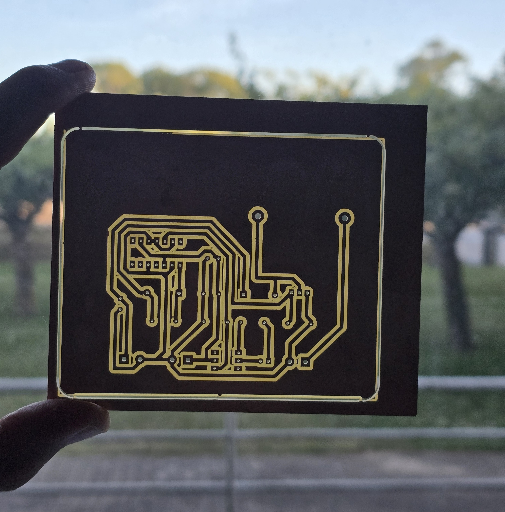

> [!TIP]
> Want **silkscreen labels** (the component names) on top? Export the **F.Silkscreen** layer as a DXF (do **not** mirror it) and engrave it on the bare top side with the Fiber laser.

<br>

### Leave the machine as you found it
Vacuum the chips, close the cover, clear the bench, and put your offcuts in the scrap box. The people who use this mill are the only ones who maintain it — DesignBuildLab doesn't — so a clean, tidy area is how we keep being able to use it.

> [!NOTE]
> Need guidance with the milling? Reach out to **Mads Rudolph** or the **TAs of the course**.

<br>

### Double-sided boards (advanced)
> [!NOTE]
> The course defaults to single-sided boards[^1]. Two-sided boards are possible on the SRM-20 but more fiddly — only attempt them after checking with the people responsible for the machine.

For a two-sided board you mill the bottom, **flip the board**, and mill the top. The lab registers the two sides with **fiducial holes only**: SRM-CAM drills reference holes in the stock, you flip and re-place the board, and it measures where the holes actually landed so the top is fitted to the real position. (The app also supports dowel pins; the lab doesn't use them, because they drill permanently into the spoilboard.) Full walkthrough: [Double-sided boards](https://madsrudolph.github.io/srm-cam/double-sided.html).

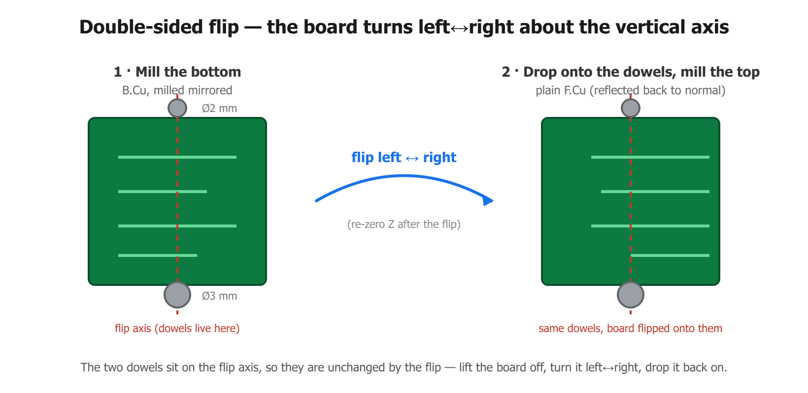

In SRM-CAM (`Interface → Full`): export your board with an **F.Cu** layer present, tick **This board has copper on both faces** on the setup page; **Fiducial holes** is the default registration. Tell it which way you turned the board (**Flipped**: left-right or top-bottom): the fit cannot detect a wrong choice, and a wrong one mirrors every top-side trace. After the flip, **Find it for me** locates each reference hole electrically (start the bit about 2 mm above the copper, never at Z0), and re-zero **only Z** on the new face.

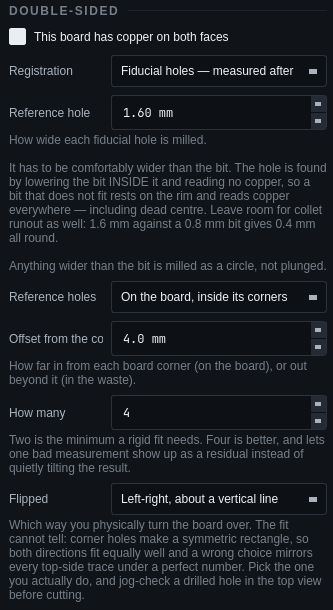

The run plan changes: the **align** program (the holes) comes first, then the bottom, then the flip, then the top, and the **cut-out last**, because it frees the board from its own registration. Follow the run sheet step by step, and re-zero **only Z** after the flip.

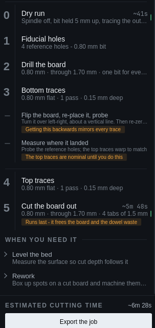

`Design X-ray` (Ctrl+D) shows both faces overlaid in the design frame, the way they are meant to line up:

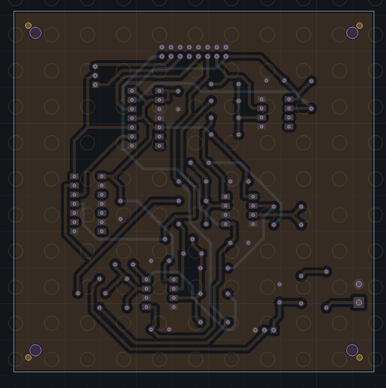

Done right, both sides line up through the holes. Here's a finished double-sided board milled this way, held up to the light:

<table>
<tr>
<td width="50%">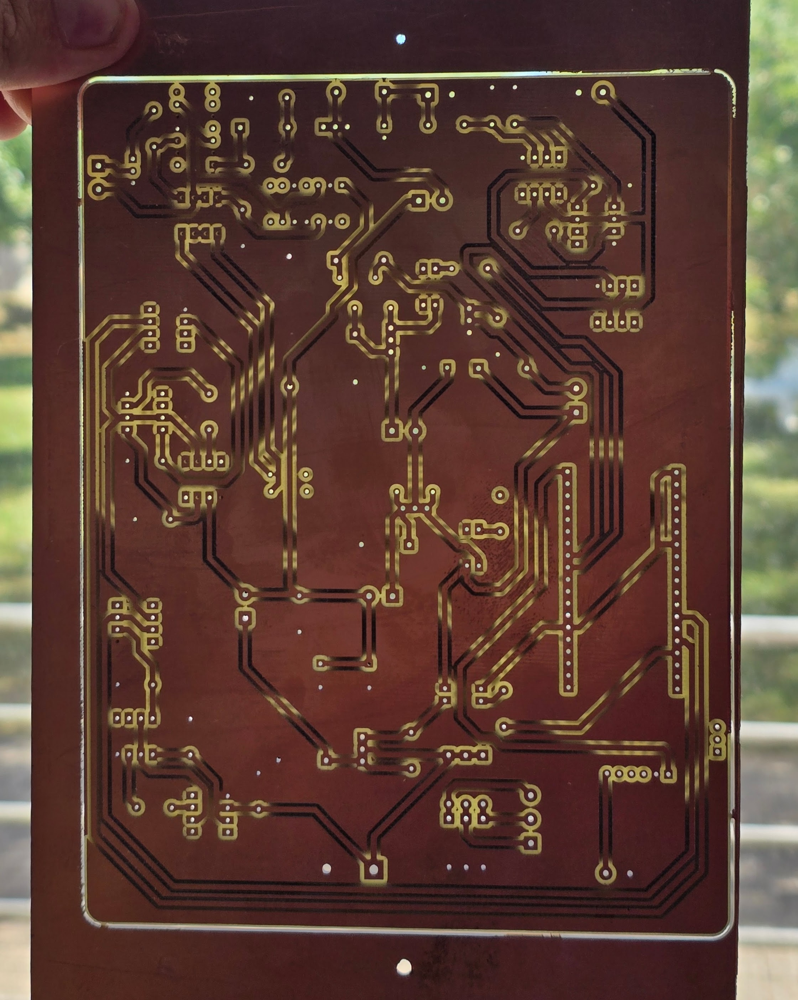<br><sub><b>Bottom side — B.Cu</b></sub></td>
<td width="50%">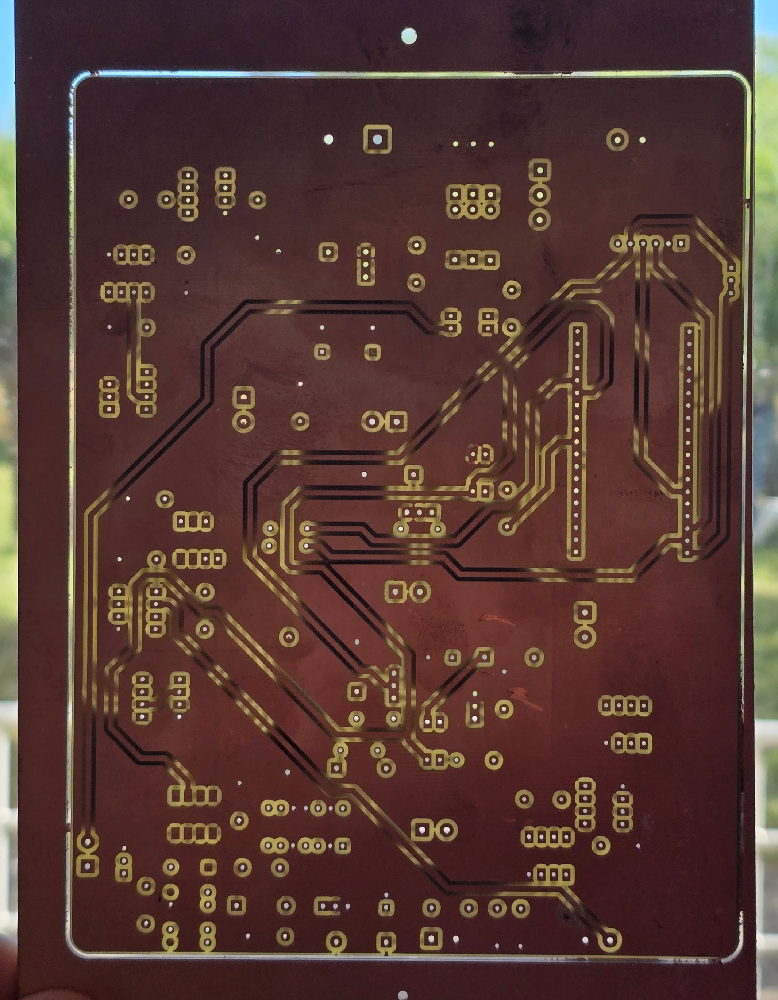<br><sub><b>Top side — F.Cu</b></sub></td>
</tr>
</table>

<br>

### Drilling a board etched on the laser
A board whose copper was etched on the Fiber laser can have its holes drilled on the SRM-20: the **Drill a board made elsewhere** step on SRM-CAM's rail measures three pads on the real board and moves the whole hole pattern onto it. Walkthrough, with the KiCad export it needs: [Drilling a laser-etched board](https://madsrudolph.github.io/srm-cam/drill-a-laser-board.html).

<br>

### Bed leveling
The lab's SRM-20 has the **touch probe** installed, so there's nothing to set up — you just attach the one clip. Bed leveling probes the copper surface and builds a height map, so the isolation depth stays consistent even if the board is slightly bowed or the bed isn't perfectly flat. It is part of Essential mode, so it is always there.

1. Plug your laptop into the machine's **Arduino** with the USB cable and click **Connect** on SRM-CAM's machine bar. (Close the Arduino Serial Monitor first — only one program can hold the port.)
2. Clip the **red alligator clip onto the copper**. That is the only wire: the bit is already wired to the probe inside the machine.
3. On the rail, open **Level the bed** and build the grid (3 × 3 to start). **Jog the bit over the first marked probe point**: every height is measured from it, so this is where you set your **final Z zero** (on G54, as above). Lift a couple of millimetres, then **Probe over the link**.
4. SRM-CAM touches each point twice. The bit taps each grid point and the measured surface draws itself over the board. If you STOP part-way, the next Probe offers to do only the missing points. **Check the mesh…** flags any point the probe got wrong and suggests where the grid is too coarse.
5. A finished probe switches on **Warp the exported cut to this surface**. Save the setup (`Ctrl+S`: the map is minutes of machine time), and export. Every cut now follows the surface.

> [!CAUTION]
> **Keep the clip clear of the cut.** Take it off (or well away from the toolpath) before the spindle starts.

> [!NOTE]
> The machine link runs on Windows. On Linux, prepare and export the job, probe on the CNC PC, and carry the height map over as a CSV (`Level the bed → Save`).

<br>

### Tell us how it went
Two minutes of [feedback](https://madsrudolph.github.io/srm-cam/feedback.html?for=guide) on what was unclear, while it is fresh, is what changes this guide and the app for the next student. No account, nothing to install; the run sheet has the same button.

<br>

